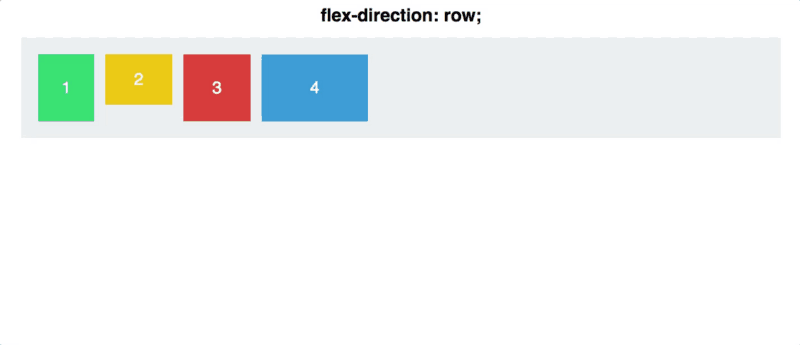
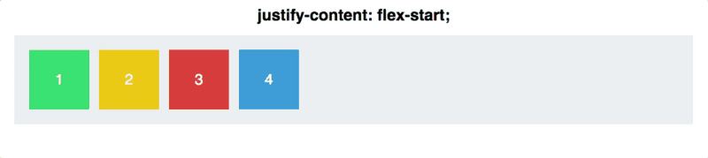
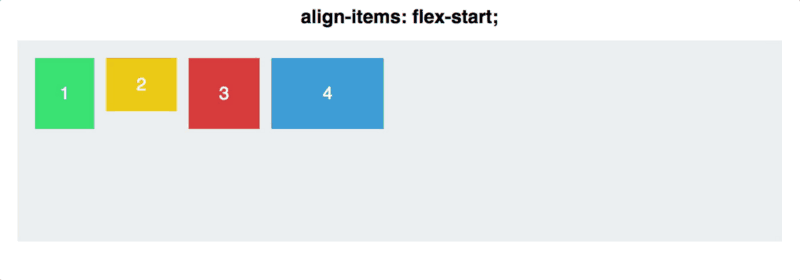

# HTML/CSS Workshop

## HTML

### HTML Basics

HTML is written with **tags**, which represent **elements**, any item displayed in the HTML. Tags must be opened with `<tag_name>`. Tags that can contain text or other tags, like `
` and `
`, must be closed with `</tag_name>`. Tags like `` that can't wrap anything don't need to be closed. **Attributes** are options on tags. Some are required for the element to render, while others just add styling or extra information. Attributes go in the opening tag after the tag name, like this:

    <tag_name attr_1="value" attr_2>

Keep in mind that although most attributes need to be assigned values, certain tag-specific ones do not (like `attr_2` in the example).

When an element contains another element, the outer one is called the **parent** and the inner one is called the **child**.

    <parent>
        <child></child>
    </parent>

Two elements on the same level are called **siblings**.

    <parent>
        <sibling1></sibling1>
        <sibling2></sibling2>
    </parent>

### Boilerplate Code

Every HTML document starts with the tag `<!DOCTYPE html>`. This tag tells anything that tries to read the file that it's coded in HTML. Your actual code must be contained in the `<html>` tag. 

The next tag is usually the `<head>` tag. This element is never displayed, but contains other elements that give metadata about the program. The most common tags you'll see in a head element are `<title>` and `<link>`. `<title>` contains the title of the file. Functionally, the title element just contains the name of the tab when the HTML is shown in a browser. The `<link>` tag is used to connect other files to the HTML, usually CSS files. `rel` is an attribute of `<link>` that defines how the linked file is related to the HTML file; for CSS files, you use `rel="stylesheet"`. You use the `href` attribute to provide the file path or URL to the file you're linking.

The last tag is the `<body>` tag. This contains all of the elements you want to display. Everything in the `<body>` tag will be rendered as the main seciton of the webpage.

This means that every HTML file will look like a variation of this:

    <!DOCTYPE html>
    <html>

    <head>
        <title>Example</title>
        <link rel="stylesheet" href="style.css">
    </head>

    <body>

        <!-- The rest of the code goes here -->

    </body>
    
    </html>

All of these boilerplate tags are just like any other tag, meaning that you can use `class`, `id`, and other attributes on them to apply styling and other options.

### `

`

`
` tags are invisible boxes that will grow to fit whatever you put in them (up to a limit). While they have no immediate visual effect, they are integral for spacing and simplifying CSS. At the most basic level, you can apply margins and padding to divs to spread out elements. However, when nested inside another container with `display: flex;`, divs are useful for having `justify-content` or `align-items` only apply to certain groups of elements. This combination of a flex container with divs inside creating groups of elements is a very powerful way to get elements quickly aligned. Combining divs with advanced CSS selectors lets you reduce the number of classes.

### `class="ex-class"` vs. `id="ex-id"`

Classes and ids are ways of identifying elements for CSS and, later, JavaScript. There are only a few functional differences:
* Selecting in CSS: `.ex-class` vs `#ex-id`
* Ids must be unique, used to name like-styled groups or unique elements (or important elements for JavaScript)
* Classes are intended to be used frequently over several elements to group styling into more general attributes
* An element may only have one id, while it can have several classes

### ``

The img tag is the way to add an image, either local or from the internet, to the HTML. The `src` attribute tells the HTML where to get the image; this can be a URL, or a file path. If the HTML can't fetch the image, it instead displays an error icon and the string in the `alt` attribute.

### `<button type="button">Label</button>`

`<button>` tags create buttons that use whatever is contained between the open and close tags as the label. This can be as simple as text, or as complicated as an entire nested-div layout. `<button>` tags are mainly useful because they already have reactive styling for when the button is clicked. Buttons should alway have the `type="button"` attribute if they aren't being used in a `<form>` element.

### `<a href="https://www.samplelink.com">Example</a>`

Anchor elements, at the simplest, allow you to make text links, like [this one](https://www.youtube.com/watch?v=dQw4w9WgXcQ). The `href` attribute lets you set the URL that the `<a>` tag will link to. Although anchors are usually used just as text links, you can use them to wrap other tags to create clickable elements, like logos that redirect to the home page.

### Text Elements

The two most useful types of text tags are the header tags (`<h1>` to `<h6>`), and the paragraph tag (`
`). The header tags are pre-styled tags intended to be used as titles and section headers. Although these do already have built-in styling, you can overwrite any styling with CSS. `
` tags are for the bulk of your text, like this paragraph.

> # This is an h1
> ## This is an h2
> ### This is an h3
> #### This is an h4
> ##### This is an h5
> ###### This is an h6
> This is a p

## CSS

### CSS Basics

CSS is used to apply styling to specific elements. CSS files have the following format:

    selector_1 {
        property_1: value;
        property_2: value;
    }

    selector_1,
    selector_2 {
        property_1: value;
        property_3: value;
    }

    /* And so on... */

Each **selector** refers to one or more elements in the HTML and applies the **properties** in the braces to each element. If thereare any syntax errors, the property simply won't be applied. There are too many properties for us to cover here, so we recommend you take a look at our reference sheet for common ones, or otherwise check out [W3's tutorial on CSS](https://www.w3schools.com/css/default.asp).

### CSS Selectors

Selectors in CSS can get extremely complicated but we'll leave some of the most common here. Go [here](https://www.w3schools.com/cssref/css_selectors.asp) for an exhaustive list of selectors.

| Selector              | Selects
| --------              | -----------
| div                   | All divs (or whatever element you name)
| .ex-class             | All elements with `class="ex-class"`
| #ex-id                | All elements with `id="ex-id`
| .class1, .class2, ... | All elements with either `class="class1"` or `class="class2"`*
| .class1 .class2 ...   | All elements with `class="class2"` that are children of elements with `class="class1"`*
| .class1.class2...     | All elements with `class="class1 class2"`*

\* These will all work with any combination of selectors (ids, classes, raw elements, etc.)

### `display: flex;`

The property `display: flex;` makes the element it is applied to into a **flexbox**. Flexboxes are extremely powerful tools for intuitive positioning and reactive designs. Although flexboxes are very complex, we'll just cover the most useful of the basic properties.

`flex-direction` sets the direction in which the flexbox will line up its children. Valid values are `row` (default), `column`, `row-reverse`, and `column-reverse`.

`justify-content` describes how the flexbox will space its items along the flex direction. Valid values are `flex-start` (default), `flex-end`, `center`, `space-between`, `space-around`, and `space-evenly`.

`align-items` does the same as `justify-content`, just along the other axis (the one perpendicular to the flex direction). Valid values are `stretch` (default), `center`, `flex-start`, `flex-end`, and `baseline`.

If you're trying to get a group of elements to be vertically centered and nicely spaced out, wrapping them in a div with code similar to the following is often a simple and quick way to do it:

    .example-class {
        display: flex;

        flex-direction: row;    /* Optional */
        justify-content: space-around;
        align-item: center;
    }

If you want more about flexboxes, check out the [source](https://www.freecodecamp.org/news/an-animated-guide-to-flexbox-d280cf6afc35/) of these GIFs or [W3's tutorial](https://www.w3schools.com/css/css3_flexbox.asp).

---

##### For more webdev resources, Jody would like to plug [ACM Hackschool](https://github.com/uclaacm/hackschool-f18).